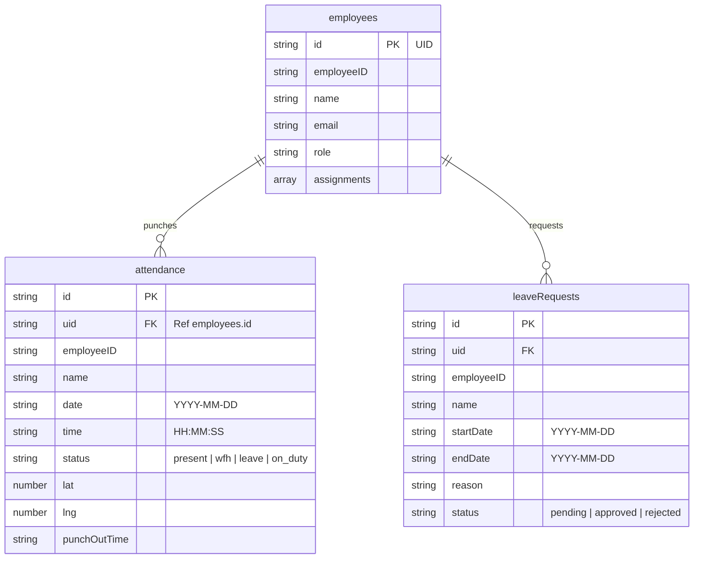

# MOBILE_APP_DOCUMENTATION.md

This document serves as the complete technical specification and user guide for the **Mobile Client** (Android APK and iOS bundle) developed for the TVS Electronics Attendance Tracker system.

---

## 1. Overview

### Purpose & Target Audience
The TVSE Attendance Tracker Mobile App provides a portable solution for logging daily workforce attendance. 
* **Primary Users**: Standard field-based and on-site **Employees** who check in and out relative to exact office geographical boundaries.
* **Secondary Users**: **Managers (Admins)** and **Super Admins** who can access administrative dashboards, employee directories, and request logs on a mobile-responsive interface.

### Relation to Web Portal
Both the React Web Portal and the Expo Mobile Client share the same serverless Firebase backend:
* **Shared Authentication**: Firebase Auth manages accounts, credentials, and tokens across both platforms.
* **Shared Database**: Both write to and read from the exact same Cloud Firestore collections (e.g. `/attendance`, `/employees`, `/leaveRequests`).

### Supported Platforms & Build System
* **Platforms**: Full support for iOS and Android.
* **Build Architecture**: Managed workflow via **Expo**. 
* **Distribution & Compilation**: Packaged and built using **Expo Application Services (EAS Build)**. The build system compiles the source code into a standalone Android APK and iOS ipa container.

---

## 2. Technology Stack

### Package Dependencies
Compiled directly from the mobile client's [package.json](file:///d:/testing/Attendance%20Tracker/mobile/package.json):

* **`expo` (v57.0.9)**: Managed React Native framework.
* **`react-native` (v0.86.2)**: Core mobile rendering engine.
* **`firebase` (v12.17.0)**: Firebase Client SDK providing direct queries to Firebase Auth and Firestore.
* **`expo-location` (v57.0.7)**: Device location API used to fetch GPS coordinates.
* **`expo-notifications` (v57.0.8)**: Handles local and push notifications.
* **`@react-native-async-storage/async-storage` (v3.1.1)**: Local persistence engine.
* **`expo-linear-gradient` (v57.0.1)**: Visual gradient styling.
* **`expo-file-system` (v57.0.1) & `expo-sharing` (v57.0.8)**: Generates and shares compiled Excel exports on mobile.
* **`xlsx` (v0.18.5)**: SheetJS compiler to convert logs into Excel sheets on device.
* **`lucide-react-native` (v1.28.0)**: SVG icon resources.

### Navigation Architecture
The application does not use external navigation libraries like React Navigation or Expo Router. Instead, navigation is handled dynamically inside [App.tsx](file:///d:/testing/Attendance%20Tracker/mobile/App.tsx) using React state routing:
* **State Interceptor**: The active screen is driven by the `activeTab` state string.
* **Conditional Rendering**: Based on the `userProfile.role` and `activeTab` value, the component tree mounts the corresponding interface block:
  * **Employee Views**: `'punch'`, `'leaves'`, `'calendar'`, `'requests'`.
  * **Admin/Super Admin Views**: `'dashboard'`, `'employees'`, `'attendance'`, `'requests'`, `'password'`, `'calendar'`.

### State Management
State is managed locally using React's native hooks (`useState`, `useRef`, `useMemo`, `useEffect`) scoped at the root level of `App.tsx` and passed down to sub-components where needed.

---

## 3. Features & Logical Flows

### 1. Login & Auth Flow
* **Component**: `App` login form container.
* **Logical Flow**:
  1. User enters email and password.
  2. The app calls `signInWithEmailAndPassword` via the Firebase SDK.
  3. On success, `onAuthStateChanged` is triggered, loading the user profile from `/employees/{uid}`.
  4. If the user's role is `employee`, the app redirects to the `'punch'` tab. If `admin` or `superadmin`, it redirects to the `'dashboard'` tab.

### 2. Geolocated Check-In / Check-Out
* **Component**: `App` under the `punch` tab view.
* **GPS Permissions**: Requests location authorization using `Location.requestForegroundPermissionsAsync()`.
* **Accuracy Configuration**: Captures coordinates using `Location.getCurrentPositionAsync()` with `enableHighAccuracy: true` and `Accuracy.Balanced`.
* **Logical Flow**:
  1. The app fetches the current GPS coordinates of the device.
  2. It loops through all office assignments assigned to the employee's profile and calculates the distance using the **Haversine formula** (`distanceKm`).
  3. If the distance to the nearest office is within the geofence radius limit (default `0.25 km` / 250 meters), the punch is labeled as on-site (`present`).
  4. If the distance exceeds the limit, the user is prompted to punch as `WFH` or `On Duty`, which requires a written justification.
  5. The check-in document is written to the `/attendance` collection.
  6. **Punch Out**: Checks out by updating the daily log document with `punchOutTime` and the check-out coordinates.

### 3. Personal Calendar / Attendance History
* **Component**: `CalendarGrid`
* **Logical Flow**:
  1. Fetches the monthly list of corporate public holidays from the `/holidays` collection.
  2. Queries the employee's attendance logs for the active month.
  3. Renders a monthly calendar grid. Days are color-coded based on the punch status: Present (Green), WFH (Blue), On-Duty (Yellow), and Leave (Red).

### 4. Leaves & WFH Request Submission
* **Component**: Under the requests submission tab.
* **Logical Flow**:
  1. The employee inputs the type (`leave` or `wfh`), date range, project assignment, and reason.
  2. Clicking submit writes a document to `/leaveRequests` or `/wfhRequests` with the status set to `pending`.
  3. The request is immediately visible to their project manager on the Web/Admin interface.

### 5. Local Notifications / Shift Reminders
* **Component**: `scheduleShiftReminder` utility.
* **Logical Flow**:
  1. Checks for notification permissions.
  2. If granted, schedules a local daily repeating notification at 9:00 AM reminding the employee to check in.

---

## 4. Database Integration

The mobile app writes and reads from the shared **Cloud Firestore** database.

### Firestore Collections Swapped by Mobile

| Collection | Operations | Handled Actions |
| :--- | :---: | :--- |
| `/employees` | Read | Fetch user details, assigned project list, and coordinate scopes |
| `/attendance` | Read / Write | Query past logs for calendar; write check-in logs and check-out updates |
| `/leaveRequests` | Read / Write | Submit leave requests; view status history |
| `/wfhRequests` | Read / Write | Submit WFH requests; view status history |
| `/holidays` | Read | Fetch public holidays to display on the calendar |

### Check-In Write Payload Fields
When checking in, the app creates a document in `/attendance` with the following parameters:
* `uid`: Employee authenticated UID.
* `employeeID`: Unique serial ID (e.g. `EMP008`).
* `name` / `email`: Employee identifiers.
* `date`: `YYYY-MM-DD`.
* `time`: `HH:MM:SS`.
* `lat` / `lng`: Check-in coordinates.
* `status`: `present` | `wfh` | `on_duty`.
* `projectId` / `projectName`: Scoped project details.
* `wfhReason` / `onDutyAtName`: Justifications.
* `createdAt`: Server timestamp.

---

## 5. Database Schema & Structure

### ER Diagram (Mobile Scope)



### JSON Document Specifications

#### 1. `/employees/{uid}`
```json
{
  "employeeID": "EMP008",
  "name": "Ankit Yadav",
  "email": "ankit.yadav@tvs-e.in",
  "role": "employee",
  "assignments": [
    {
      "projectId": "ITC-LTD",
      "projectName": "ITC LTD - Lucknow",
      "officeId": "LKO-01",
      "officeName": "ITC Lucknow Office",
      "officeLat": 26.8467,
      "officeLng": 80.9462
    }
  ]
}
```

#### 2. `/attendance/{id}`
```json
{
  "uid": "user_auth_uid_123",
  "employeeID": "EMP008",
  "name": "Ankit Yadav",
  "email": "ankit.yadav@tvs-e.in",
  "date": "2026-08-06",
  "time": "09:12:04",
  "lat": 26.8465,
  "lng": 80.9461,
  "status": "present",
  "projectId": "ITC-LTD",
  "projectName": "ITC LTD - Lucknow",
  "punchOutTime": "18:05:43",
  "punchOutLat": 26.8468,
  "punchOutLng": 80.9463
}
```

---

## 6. Permissions & Security

### Device Permissions
The mobile app requests:
* **Foreground Location**: Required to run check-in distance calculations.
* **Notification Permissions**: Required to trigger shift reminders.

### Security Rules Constraints
All writes from the mobile app are verified against the authenticated user token (`request.auth.uid`). A standard employee cannot write or modify attendance or request records where the `uid` field does not match their own authenticated UID.

---

## 7. Build & Deployment

### Build Profile (`eas.json`)
The application defines Android and iOS compilation profiles:
```json
{
  "cli": {
    "version": ">= 10.0.0"
  },
  "build": {
    "development": {
      "developmentClient": true,
      "distribution": "internal"
    },
    "preview": {
      "distribution": "internal"
    },
    "production": {}
  }
}
```

### Build Commands
1. **Login to Expo CLI**: `npx expo login`
2. **Compile Standalone Android APK**:
   ```bash
   eas build --platform android --profile preview
   ```
3. **Local Bundling**:
   * Run local Dev Server: `npx expo start`
