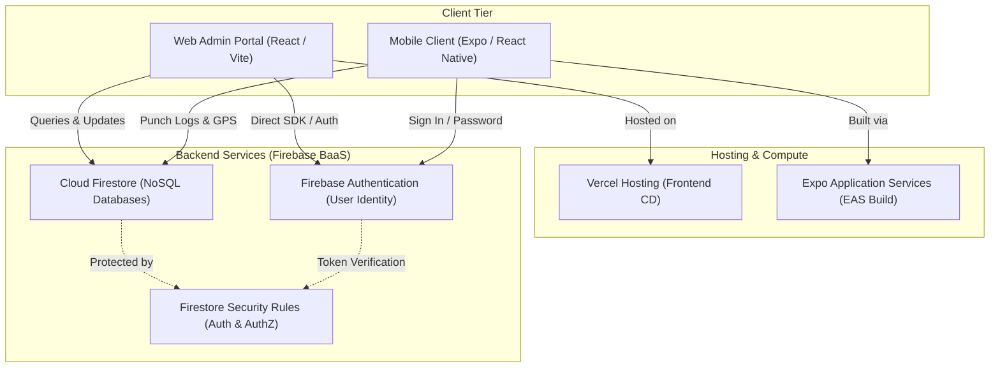

# TVS Attendance Tracker - System & Code Documentation

This documentation provides an exhaustive, granular reference of the Attendance Tracker codebase. It covers the system architectures, the dependency layers, the exact database models, role-based interfaces, custom math/transactional algorithms, security configurations, and deployment procedures.

---

## 1. Executive Overview

### Project Purpose & Intent
The **TVS Electronics Attendance Tracker** is a secure, role-restricted web and mobile application designed to streamline workforce management. It solves the challenges of geolocated attendance verification, remote work (WFH/On-Duty) tracking, and leave management for large teams spread across multiple geographical office locations and corporate projects.

### Web Portal + Mobile Client Core Relationship
The platform splits functions across two interface modes:
1. **Web Portal (Vite + React)**: Primarily serves as the administrative, tracking, and reporting suite. Scoped managers (Admins) and Super Administrators use it to review live daily punch stats, manage employee directories, define geographical office points, reconcile leave balances, process regularization requests, and export Excel spreadsheets.
2. **Mobile Portal / APK (Expo Container)**: Provides a simplified employee interface optimized for handheld devices. It utilizes device GPS sensors to perform geofenced validation at check-in/out, display personal calendar heatmaps, track leave balances, and submit requests directly from the field.

---

## 2. Technology Stack & Dependencies

Below is the list of core library dependencies compiled from [package.json](file:///d:/testing/Attendance%20Tracker/package.json) with their specific function in the system:

### Core Frameworks & Routing
* **`react` & `react-dom` (v19.2.0)**: Component tree model and UI rendering engine.
* **`@tanstack/react-router` (v1.168.25)**: Manages type-safe client-side routing, layout hierarchy, search parameters, and navigation guard intercepts.
* **`vite` (v7.3.1)**: Build system and development server, utilizing `@tanstack/router-plugin` for automated file-based route definitions.
* **`typescript` (v5.8.3)**: Provides static typing across components, models, and data layer configurations.

### Visual & Map Analytics
* **`leaflet` (v1.9.4) & `react-leaflet` (v5.0.0)**: Open-source map wrappers used to configure geographical office boundary markers and coordinates.
* **`recharts` (v2.15.4)**: SVG chart engine rendering daily attendance trends and activity distributions.
* **`lucide-react` (v0.575.0)**: Unified icon sets across navigation bars, buttons, and status indicator blocks.

### State, Forms & Helpers
* **`@tanstack/react-query` (v5.83.0)**: Cache manager and asynchronous state handler for querying API/database endpoints.
* **`react-hook-form` (v7.71.2) & `zod` (v3.24.2)**: Form element state validation and strict schema checks.
* **`date-fns` (v4.1.0)**: High-performance utility library for date math, formatting, calendar calculations, and business day audits.
* **`xlsx` (v0.18.5)**: Client-side Excel compiler to compile and export structured multi-sheet reports.
* **`sonner` (v2.0.7)**: Toast notification engine rendering feedback alerts.

---

## 3. System Architecture & Component Integrations

### General Architecture
The application uses a serverless, decoupled **Backend-as-a-Service (BaaS)** model. Both the web client and mobile clients establish direct connections to Firebase BaaS APIs:



### End-to-End Logical Flows

#### 1. Geocoded Check-In Flow (Employee)
1. The employee loads the app and selects their current project.
2. The application requests GPS coordinates from the browser/device location API.
3. The app calculates the distance between the employee's location and their assigned project offices.
4. If the location falls inside the geofence radius, the user checks in. The app writes a document containing check-in parameters and status (`present`) to the `/attendance` collection.
5. If the location falls outside the boundary, the user must select `WFH` or `On Duty` and enter a justification. Checking in writes the document with the respective status and reason.

#### 2. Request Submission & Cascading Approvals Flow
1. An employee submits a `leaveRequest` or `wfhRequest` from their mobile interface, which creates a pending request document in Firestore.
2. The scoped Project Manager (Admin) reviews the request via [admin.requests.tsx](file:///d:/testing/Attendance%20Tracker/src/routes/admin.requests.tsx).
3. If approved, the Admin changes the request document status to `approved`.
4. The approval action triggers a write query that automatically creates or updates the corresponding daily record in the `/attendance` collection with the new status (e.g. `leave`), ensuring team calendar logs are updated.

---

## 4. Implementation Details

### File Structure Reference
* `src/routes/`
  * `__root.tsx`: Standard wrapper for global context providers, error bounds, and TanStack Router mounting.
  * `index.tsx`: Redirection point redirecting logged-in users to their role-specific dashboards.
  * `login.tsx`: Form validation and password submission to Firebase Auth.
  * `super.tsx`: Configuration dashboard for Projects and Office location coordinates.
  * `admin.index.tsx`: Scoped administrator daily metrics panel.
  * `admin.dashboard.tsx`: Scoped monthly statistics, Recharts trends, and Excel exports.
  * `admin.employees.tsx`: Scoped employee profile listings, CRUD forms, and ID utilities.
  * `admin.attendance.tsx`: Raw daily attendance records log viewer and exporter.
  * `admin.requests.tsx`: Approvals panel for Leaves, WFH, and Regularization requests.
  * `app.index.tsx`: Employee punch page, calendar view, and request panel.
  * `app.change-password.tsx`: Profile password update settings panel.

* `src/components/`
  * `RequireAuth.tsx`: Navigation wrapper validating active session parameters, loading roles, and rendering layout shells.
  * `CalendarView.tsx`: Core employee calendar UI rendering colored badges on specific daily logs.
  * `OfficeLocationPicker.tsx`: Leaflet coordinate configuration map picker.

* `src/lib/`
  * `auth-context.tsx`: Context manager handling Firebase Auth state changes and user profile cache logs.
  * `employee-id.ts`: Helper algorithms for transactional ID generations and previews.
  * `geo.ts`: Location calculations using the Haversine formula.

---

### Core Algorithms & Logic

#### 1. Geofencing Calculations (Haversine Formula)
In [geo.ts](file:///d:/testing/Attendance%20Tracker/src/lib/geo.ts), the distance between employee and office coordinates is calculated as follows:
```typescript
export function distanceKm(lat1: number, lng1: number, lat2: number, lng2: number) {
  const toRad = (d: number) => (d * Math.PI) / 180;
  const R = 6371; // Earth's radius in kilometers
  const dLat = toRad(lat2 - lat1);
  const dLng = toRad(lng2 - lng1);
  const a =
    Math.sin(dLat / 2) ** 2 +
    Math.cos(toRad(lat1)) * Math.cos(toRad(lat2)) * Math.sin(dLng / 2) ** 2;
  return 2 * R * Math.asin(Math.sqrt(a));
}
```

#### 2. Unique Employee ID Counter Transaction
In [employee-id.ts](file:///d:/testing/Attendance%20Tracker/src/lib/employee-id.ts), new IDs are generated sequentially. A preview function allows admins to see the next ID, while a transaction reserves it on save:
```typescript
/** Gets the next employee ID without incrementing the counter. */
export async function peekNextEmployeeId(): Promise<string> {
  const snap = await getDoc(COUNTER_REF);
  const next = snap.exists() ? (snap.data().next as number) : 1;
  return `EMP${String(next).padStart(3, "0")}`;
}

/** Atomically reserves the next employee ID (EMP001, EMP002, ...). */
export async function nextEmployeeId(): Promise<string> {
  const id = await runTransaction(db, async (tx) => {
    const snap = await tx.get(COUNTER_REF);
    const next = snap.exists() ? (snap.data().next as number) : 1;
    tx.set(COUNTER_REF, { next: next + 1, updatedAt: serverTimestamp() }, { merge: true });
    return `EMP${String(next).padStart(3, "0")}`;
  });
  return id;
}
```

#### 3. ID Re-sequencing & Database Cascade Update
In [admin.employees.tsx](file:///d:/testing/Attendance%20Tracker/src/routes/admin.employees.tsx), a utility re-sequences all employee IDs numerically. To prevent data corruption, it cascades updates to all corresponding employeeID fields across references:
```typescript
const resequenceEmployeeIds = async () => {
  // Sort numerically
  emps.sort((a, b) => {
    const numA = parseInt(a.employeeID?.replace(/\D/g, "") || "0", 10);
    const numB = parseInt(b.employeeID?.replace(/\D/g, "") || "0", 10);
    return numA - numB;
  });

  for (let i = 0; i < emps.length; i++) {
    const emp = emps[i];
    const newID = `EMP${String(i + 1).padStart(3, "0")}`;

    if (emp.employeeID !== newID) {
      await updateDoc(doc(db, "employees", emp.id), { employeeID: newID });

      // Cascade updates
      const attSnap = await getDocs(query(collection(db, "attendance"), where("uid", "==", emp.id)));
      for (const d of attSnap.docs) await updateDoc(doc(db, "attendance", d.id), { employeeID: newID });

      const leaveSnap = await getDocs(query(collection(db, "leaveRequests"), where("uid", "==", emp.id)));
      for (const d of leaveSnap.docs) await updateDoc(doc(db, "leaveRequests", d.id), { employeeID: newID });

      const wfhSnap = await getDocs(query(collection(db, "wfhRequests"), where("uid", "==", emp.id)));
      for (const d of wfhSnap.docs) await updateDoc(doc(db, "wfhRequests", d.id), { employeeID: newID });

      const regSnap = await getDocs(query(collection(db, "regularizationRequests"), where("uid", "==", emp.id)));
      for (const d of regSnap.docs) await updateDoc(doc(db, "regularizationRequests", d.id), { employeeID: newID });
    }
  }
};
```

---

### Firestore Security Rules Summary
Defined in [firestore.rules](file:///d:/testing/Attendance%20Tracker/firestore.rules):
* **Employees**:
  ```javascript
  match /employees/{uid} {
    allow read: if isSignedIn() && (request.auth.uid == uid || isSuperAdmin() || isAdminOfAny(empProjectIds(resource.data)));
    allow create: if isSuperAdmin() || (isSignedIn() && request.auth.uid == uid) || isAdminOfAny(empProjectIds(request.resource.data));
    allow update: if isSuperAdmin() || isAdminOfAny(empProjectIds(resource.data)) || (isSignedIn() && request.auth.uid == uid);
    allow delete: if isSuperAdmin() || isAdminOfAny(empProjectIds(resource.data));
  }
  ```
* **Attendance & Requests**: Verified by `isAdminOf(resource.data.projectId)` or `isSuperAdmin()`. Restricts standard users to reading/creating entries matching their own authenticated `uid`.
* **Meta counter**: Restricts access to authenticated admins or superadmins:
  ```javascript
  match /meta/{id} {
    allow read: if isSuperAdmin() || isAdmin();
    allow write: if isSuperAdmin() || isAdmin();
  }
  ```

---

## 5. User Roles & Permissions Matrix

### 1. Employee
* **Definition**: General workforce users assigned the `employee` role in their employee profile.
* **Landing Route**: `/app`
* **Routes Access**: `/app/`, `/app/change-password`
* **Feature Table**:

| Feature | What they can do | What they cannot do | Implementation Component |
| :--- | :--- | :--- | :--- |
| **Geofenced Check-In** | Punch in/out within geofence limits as `present` | Modify coordinates or check-in to unassigned projects | `app.index.tsx` |
| **WFH / On-Duty** | Check in off-site by providing a justification | Skip check-out or check-in without reason when outside | `app.index.tsx` |
| **Requests Panel** | Request Leaves, WFH, or Regularization | Approve or edit requests once submitted | `app.index.tsx` |
| **Calendar View** | Check personal monthly attendance and leave balance | Edit historical entries directly | `CalendarView.tsx` |

---

### 2. Scoped Admin
* **Definition**: Project Managers assigned the `admin` role, with access scoped to projects listed in their profile's `adminProjects` array.
* **Landing Route**: `/admin`
* **Routes Access**: `/admin/`, `/admin/dashboard`, `/admin/employees`, `/admin/attendance`, `/admin/requests`
* **Feature Table**:

| Feature | What they can do | What they cannot do | Implementation Component |
| :--- | :--- | :--- | :--- |
| **Daily Overview** | View active statistics, reconcile leaves, and export project data | Access data for unassigned projects | `admin.index.tsx` |
| **Monthly Dashboard** | View monthly trends, employee tables, and export reports | Access data for unassigned projects | `admin.dashboard.tsx` |
| **Employee CRUD** | Create and manage employee profiles | Allocate employees to projects they don't manage | `admin.employees.tsx` |
| **Attendance Editor** | View, edit, or delete raw team daily punches | Modify records for unassigned projects | `admin.attendance.tsx` |
| **Request Approvals** | Approve or reject Leave, WFH, and Regularizations | Review requests for unassigned projects | `admin.requests.tsx` |

---

### 3. Super Admin
* **Definition**: Global administrators assigned the `superadmin` role.
* **Landing Route**: `/super`
* **Routes Access**: All admin routes plus `/super`
* **Feature Table**:

| Feature | What they can do | What they cannot do | Implementation Component |
| :--- | :--- | :--- | :--- |
| **Project Setup** | Create, edit, and delete corporate project codes | None | `super.tsx` |
| **Office Coordinate Setup** | Configure office location markers and geofences | None | `super.tsx` & `OfficeLocationPicker.tsx` |
| **ID Re-sequencing** | Re-sequence employee ID counters database-wide | None | `admin.employees.tsx` |

---

### Consolidated Permissions Matrix

| Feature | Employee | Scoped Admin | Super Admin |
| :--- | :---: | :---: | :---: |
| **Punch In/Out** | ✅ (Own UID) | ✅ (Scope Admins) | ✅ (All Projects) |
| **Submit Requests** | ✅ (Own UID) | ❌ | ❌ |
| **Approve Requests** | ❌ | Scoped Projects | ✅ (All Projects) |
| **Manage Employees** | ❌ | Scoped Projects | ✅ (All Projects) |
| **Re-sequence IDs** | ❌ | ❌ | ✅ |
| **Manage Projects/Offices** | ❌ | ❌ | ✅ |

---

## 6. Database Schema Reference

Below is the Firestore collection reference based on the codebase interfaces:

### 1. `employees`
* **Path**: `/employees/{uid}` (where `{uid}` corresponds to Firebase Auth UID).
* **Properties**:
  * `employeeID` *(string)*: Unique sequential ID (e.g. `EMP001`).
  * `name` *(string)*: Full name.
  * `email` *(string)*: Email address.
  * `role` *(string)*: `superadmin` | `admin` | `employee`.
  * `projectIds` *(array of strings)*: List of assigned projects.
  * `projectId` *(string | null)*: Primary project ID.
  * `projectName` *(string | null)*: Primary project name.
  * `assignments` *(array of objects)*: Assigned locations and coordinates:
    ```typescript
    interface Assignment {
      projectId: string;
      projectName?: string;
      officeId?: string;
      officeName?: string;
      officeLat: number;
      officeLng: number;
    }
    ```
  * `totalLeaves` *(number)*: Total leave days allowed.
  * `usedLeaves` *(number)*: Total leaves taken.

### 2. `attendance`
* **Path**: `/attendance/{id}`
* **Properties**:
  * `uid` *(string)*: Reference to the employee's document UID.
  * `employeeID` *(string)*: Copy of the employee ID.
  * `name` *(string)*: Employee name.
  * `email` *(string)*: Employee email.
  * `date` *(string)*: Check-in date in `YYYY-MM-DD` format.
  * `time` *(string)*: Punch-in time in `HH:MM:SS` format.
  * `lat` / `lng` *(number)*: Latitude/longitude at check-in.
  * `punchOutTime` *(string)*: Punch-out time in `HH:MM:SS` format.
  * `punchOutLat` / `punchOutLng` *(number)*: Coordinates at check-out.
  * `status` *(string)*: `present` | `wfh` | `leave` | `on_duty`.
  * `leaveReason` / `wfhReason` *(string)*: Justification for leave/WFH.

---

## 7. Deployment & Environment

### Deployment Targets
1. **Web Client**: Deployed on **Vercel** with automatic deployment on git pushes.
2. **Mobile APK**: Compiled to an Android APK package using **Expo Application Services (EAS)**:
   * Build command: `eas build -p android`

### Environment Variables
Configure the following variable in the deployment environment:
* `VITE_USE_FIREBASE_EMULATOR` *(boolean)*: Set to `true` in local environments to redirect database calls to Local Emulators, or `false` in production.
